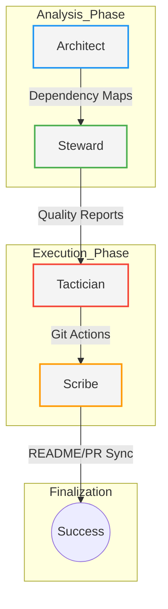
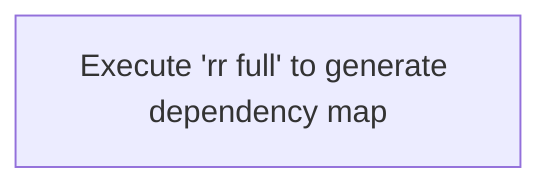

# RepoRanger

**Autonomous Code Steward & DevOps Orchestrator**

RepoRanger is a multi-agent system built on **LangGraph**, designed to bridge the gap between source code and its surrounding ecosystem (documentation, quality standards, and CI/CD). It operates as a Principal Engineer within your repository, performing deterministic static analysis combined with generative reasoning to ensure your project remains healthy, documented, and architecturally sound.

---

## System Vision
RepoRanger utilizes an artifact-driven workflow to maintain a "Compressed Context" model. Rather than feeding an entire codebase into an LLM, RepoRanger's agents extract specific metrics and structures, passing only relevant artifacts downstream. This ensures high precision, lower token costs, and superior reasoning.



### Architecture Specifications
| Layer | Technical Implementation |
| --- | --- |
| **Orchestration** | LangGraph State Machine with a shared `RepoState` clipboard. |
| **Intelligence** | Google Gemini 1.5 Pro / Flash for generative synthesis. |
| **Deterministic Engine** | Python `ast` module for cyclomatic complexity and dependency resolution. |
| **Persistence** | Structured workspace in `.reporanger_workspace` managed via `workspace.py`. |
| **Visualization** | Automated Mermaid.js generation for live system mapping. |

---

## Agent Swarm Roles
### 🏛️ Visual Architect

The Architect is responsible for the "Big Picture." It performs full-repo indexing to generate system-wide dependency graphs and complexity heatmaps.

* **Deliverables:** `dependency_graph.mmd`, `complexity_heatmap.mmd`, `architecture_overview.md`.

### 🛡️ Code Steward
The Steward acts as the first line of defense against technical debt. It computes AST metrics, detects unreachable code, and audits changed files against complexity thresholds.

* **Deliverables:** `code_quality_report.md`, `refactor_plan.json`.

### ⚔️ Git Tactician
The Tactician translates analysis into action. It manages the Git lifecycle by creating semantic branches, staging changes, and ensuring the repository remains in a safe state.

* **Deliverables:** `git_workflow.md`, automated branch creation.

### ✍️ Contextual Scribe
The Scribe ensures documentation never drifts from reality. It synthesizes diffs and agent artifacts into high-density PR narratives and performs the "Master README Sync."

* **Deliverables:** `PR_Document.md`, `README.md` updates, `COMMIT_MESSAGE.txt`.

---

## System Health & Documentation Status 
RepoRanger automatically updates this section during `full` execution mode to reflect the current state of the repository.

### Recent Code Quality Audit* **Status:** Analysis Pending
* **Audit Timestamp:** 2025-12-17 03:45 UTC
* **Health Metric:** No critical blockers detected in the core logic.

### Live Architecture
The following diagram represents the real-time module relationships within this repository:



> Tip: If the diagram above is empty, run `python main.py --mode full` to trigger the Architect.

---

## 🚀 Getting Started
RepoRanger is designed to be set up in under 5 minutes.

### 1. Local Installation
```bash
# Clone the repository
git clone https://github.com/SRDdev/RepoRanger.git
cd RepoRanger

# Install the package in editable mode
pip install .

# Setup your environment
echo "GOOGLE_API_KEY=your_gemini_api_key_here" > .env
```

### 2. Usage Commands
| Command | Action |
| --- | --- |
| `rr branch -m "Intent"` | Create a semantic branch based on your goal. |
| `rr full` | Perform a full system audit and update README diagrams. |
| `rr commit` | Generate a professional Conventional Commit message. |

---

## 🤖 GitHub Actions Integration
To enable RepoRanger to review your Pull Requests automatically, add your `GOOGLE_API_KEY` to your GitHub Repository Secrets and ensure the `.github/workflows/reporanger-analysis.yml` is present.

### Required Permissions
RepoRanger requires the following permissions in your workflow to post comments and analyze diffs:

```yaml
permissions:
  contents: read
  pull-requests: write
  issues: write

```

---

## 🤝 Contributing
We welcome contributions that improve agent reasoning or tool deterministic accuracy.

1. **Branch:** Use `python main.py branch --intent "Your feature"`
2. **Verify:** Run `python main.py --mode full` to ensure no regression in quality.
3. **Submit:** Ensure `PR_Document.md` is attached to your Pull Request.

---

## 📄 License
Licensed under the **MIT License**. Created and maintained by the RepoRanger Contributors.