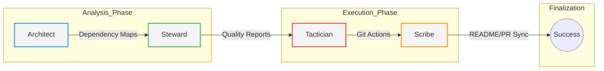
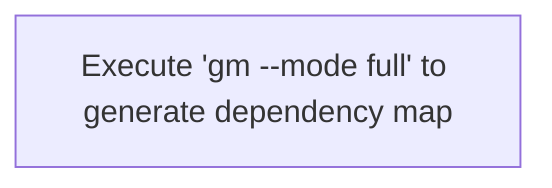

# GitMentor

<p align="center">
  
</p>

<p align="center">
  
  
  
</p>

**Autonomous Code Steward & DevOps Orchestrator**

GitMentor is a multi-agent system built on **LangGraph**, designed to bridge the gap between source code and its surrounding ecosystem (documentation, quality standards, and CI/CD). It operates as a Principal Engineer within your repository, performing deterministic static analysis combined with generative reasoning to ensure your project remains healthy, documented, and architecturally sound.

---

## System Vision

GitMentor utilizes an artifact-driven workflow to maintain a "Compressed Context" model. Rather than feeding an entire codebase into an LLM, GitMentor's agents extract specific metrics and structures, passing only relevant artifacts downstream. This ensures high precision, lower token costs, and superior reasoning.



### Architecture Specifications
| Layer | Technical Implementation |
| --- | --- |
| **Orchestration** | LangGraph State Machine with a shared `RepoState` clipboard. |
| **Intelligence** | Google Gemini 2.0 Flash for generative synthesis. |
| **Deterministic Engine** | Python `ast` module for cyclomatic complexity and dependency resolution. |
| **Persistence** | Structured workspace in `.gitmentor_workspace` managed via `workspace.py`. |
| **Visualization** | Automated Mermaid.js generation for live system mapping. |

---

## Agent Swarm Roles
### 🏛️ Visual Architect
Responsible for the "Big Picture." Performs full-repo indexing to generate system-wide dependency graphs and complexity heatmaps.

* **Deliverables:** `dependency_graph.mmd`, `complexity_heatmap.mmd`, `architecture_overview.md`.

### 🛡️ Code Steward
The first line of defense against technical debt. Computes AST metrics, detects unreachable code, and audits changed files against complexity thresholds.

* **Deliverables:** `code_quality_report.md`, `refactor_plan.json`.

### ⚔️ Git Tactician
Translates analysis into action. Manages the Git lifecycle by creating semantic branches, staging changes, and ensuring the repository remains in a safe state.

* **Deliverables:** `git_workflow.md`, automated branch creation.

### ✍️ Contextual Scribe
Ensures documentation never drifts from reality. Synthesizes diffs and artifacts into high-density PR narratives and performs the "Master README Sync."

* **Deliverables:** `PR_Document.md`, `README.md` updates, `COMMIT_MESSAGE.txt`.

---

## System Health & Documentation Status
GitMentor automatically updates this section during `full` execution mode to reflect the current state of the repository.

### Recent Code Quality Audit* **Status:** Analysis Pending
* **Audit Timestamp:** 2025-12-17 04:15 UTC
* **Health Metric:** No critical blockers detected in the core logic.

### Live Architecture
The following diagram represents the real-time module relationships within this repository:



> Tip: If the diagram above is empty, run `gm --mode full` to trigger the Architect.

---

## 🚀 Getting Started
### 1. Local Installation
```bash
# Clone the renamed repository
git clone https://github.com/SRDdev/GitMentor.git
cd GitMentor

# Install in editable mode to activate 'gm' command
pip install -e .

# Setup your environment
echo "GOOGLE_API_KEY=your_gemini_api_key_here" > .env

```

## 2. Usage Commands

| Command | Action |
| --- | --- |
| **Branching** |  |
| `gm branch -m "Intent"` | Creates a semantic branch name based on your goal and switches to it. |
| `gm branch -m "Intent" -t fix` | Creates a branch while forcing a specific type (`feat`, `fix`, `refactor`, etc.). |
| **Analysis & Docs** |  |
| `gm --mode full` | Performs a full system audit, updates README diagrams, and generates reports. |
| `gm --mode pr` | Generates a high-density `PR_Document.md` comparing current work to the target branch. |
| `gm --mode docs` | Refreshes only the technical documentation and system specifications. |
| **Commit Workflow** |  |
| `gm --mode commit` | Analyzes staged changes and generates a professional Conventional Commit message. |
| `gm --commit-intent "Context"` | Provides the AI with specific context to refine the generated commit message. |
| **Configuration** |  |
| `gm --target-branch main` | Sets the base branch for diffing and analysis (default is `main`). |
| `gm --help` | Displays the full CLI manual and available agent flags. |

---

## Recommended Workflow

To get the most out of **GitMentor**, follow this professional engineering loop:

1. **Initialize**:  
   `gm branch -m "implement oauth login"`

2. **Develop**:  
   (Write your code changes)

3. **Stage**:  
   `git add .`

4. **Describe**:  
   `gm --mode commit` → `git commit -F COMMIT_MESSAGE.txt`

5. **Finalize**:  
   `gm --mode full`  
   *(Ensures README diagrams are updated before pushing)*

6. **Submit**:  
   `git push origin <branch>`

---

## Quality Standards

GitMentor's Code Steward enforces the following quality standards:

*   **Cyclomatic Complexity Threshold:** Functions exceeding a complexity score of X will be flagged for review.
*   **Unreachable Code Detection:** Identifies and reports any unreachable code blocks.
*   **Dependency Management:** Enforces clear and well-defined module dependencies.
*   **Documentation Completeness:** Ensures all public functions and classes have docstrings.

---

## 🤖 GitHub Actions Integration
To enable GitMentor to review your Pull Requests automatically, add your `GOOGLE_API_KEY` to your GitHub Repository Secrets and ensure the `.github/workflows/gitmentor.yml` is present.

### Required Permissions
```yaml
permissions:
  contents: read
  pull-requests: write
  issues: write

```

---

## 🤝 Contributing
We welcome contributions that improve agent reasoning or tool deterministic accuracy.

1. **Branch:** Use `gm branch --intent "Your feature"`
2. **Verify:** Run `gm --mode full` to ensure no regression in quality.
3. **Submit:** Ensure `PR_Document.md` is generated and attached to your PR.

---

## 📄 License
Licensed under the **MIT License**. Created and maintained by the GitMentor Contributors.